

<picture>
  <source media="(prefers-color-scheme: dark)" srcset="docs/brand/logo-dark.svg">
  
</picture>

**A quiet place to write stories and read them.**

Live since 14 September 2026 · English and Arabic · reading is open to everyone

---

## Table of contents

- [Overview](#overview)
- [What's new in v2](#whats-new-in-v2)
- [Screenshots](#screenshots)
- [Features](#features)
- [Tech stack](#tech-stack)
- [Architecture and design decisions](#architecture-and-design-decisions)
- [Roadmap](#roadmap)
- [Source code](#source-code)
- [Acknowledgments](#acknowledgments)
- [License](#license)

---

## Overview

StoryHub is a full-stack platform for long-form, true stories — what happened to you, what you achieved, what went wrong and what it taught you, what you think. It is built for people who want a calmer alternative to a noisy feed: reading and writing come first, with just enough social layer (following, likes, threaded comments, bookmarks, notifications) to make the place feel alive.

The whole interface is bilingual — **English and Arabic, with full right-to-left layout** — and stories can be written in either.

It is built as two pieces: a **Django REST Framework** API and a **React + TypeScript** single-page application that consumes it, running together on one server behind Nginx.

## What's new in v2

Version 2 is a rebuild of the front end and a hardening pass over the back end. Almost nothing from v1 survived untouched.

- **A visitor landing page** — a signed-out stranger at `/` gets an introduction rather than a feed: a headline that is typed in front of them (with a human's pauses and slips), the most-liked story on the site, a compass of real categories and tags, and live demonstrations of the editor, the notifications and a writer's page. Members still land on their feed.
- **Arabic and English, properly** — every string, both directions, mirrored components, locale-aware dates and plurals, and a bidi rule for user text so an Arabic name in an English interface (or the reverse) never comes out mangled.
- **A rich-text editor** (Tiptap) with headings, quotes, lists, links and **inline images** uploaded as you write — and a server that **sanitises on write** with an allow-list, so the database never holds markup it would be unsafe to render.
- **A new design system** — one set of colour tokens with a light and a dark value each, a display typeface for headlines, Radix primitives for menus, dialogs, tabs and selects, and no component-level theme code.
- **Explore** — categories and tags in one place, with a spotlight that suggests where to start.
- **A feed companion** — beside the feed, what the stories on your screen are made of: their categories, tags and the writers behind them, derived from what is already loaded.
- **Verified identity** — a badge on writers whose identity the site has confirmed, drawn wherever their name appears.
- **Categories with a label per language** — the English name is the stable key, the Arabic label lives on the category itself, and filter URLs use slugs (`?category=failure-lessons`).
- **A help centre** with client-side search, and a place to reach a real mailbox.
- **Followers-only stories** — a writer chooses who may read each story: everyone, or the people who follow them. One visibility rule on the queryset guards the feeds, the writer's page, direct links, likes, comments and bookmarks alike; a link to a gated story answers with an invitation to follow, and following opens it in place. Followers are notified when a writer they follow publishes.
- **PostgreSQL**, request throttling with a tighter budget for authentication, a profiler that cannot ship to production, early failure on missing configuration, and a test suite that went from 3 tests to 85.

## Screenshots

| Landing page | Landing page (dark) |
|---|---|
| 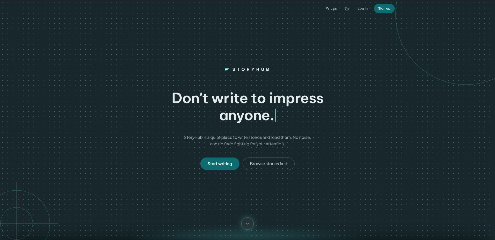 | 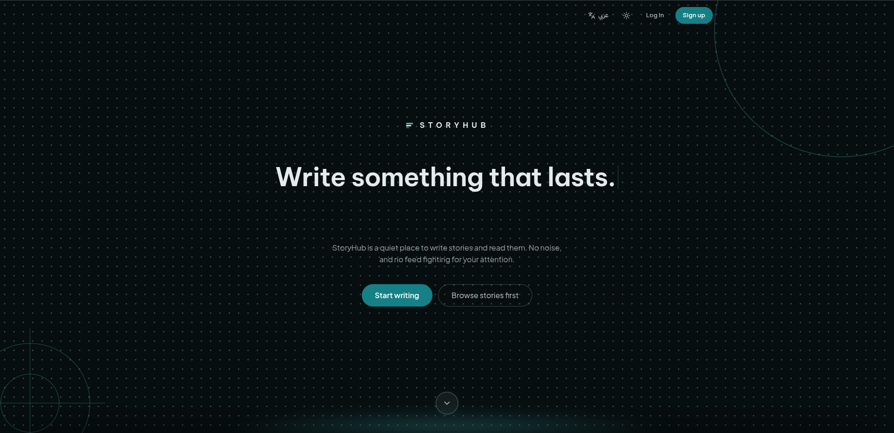 |

| Feed | Feed (dark) |
|---|---|
| 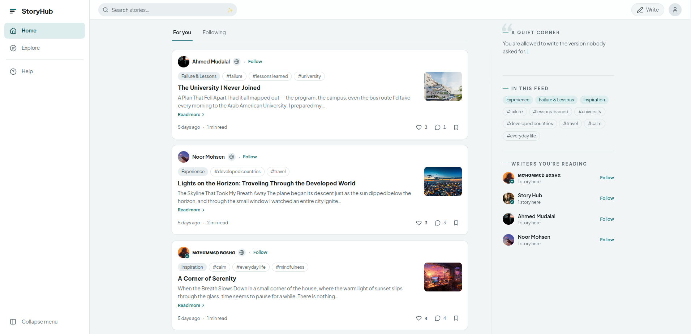 | 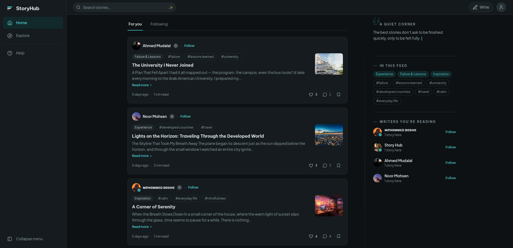 |

| Feed in Arabic (RTL) | Story |
|---|---|
| 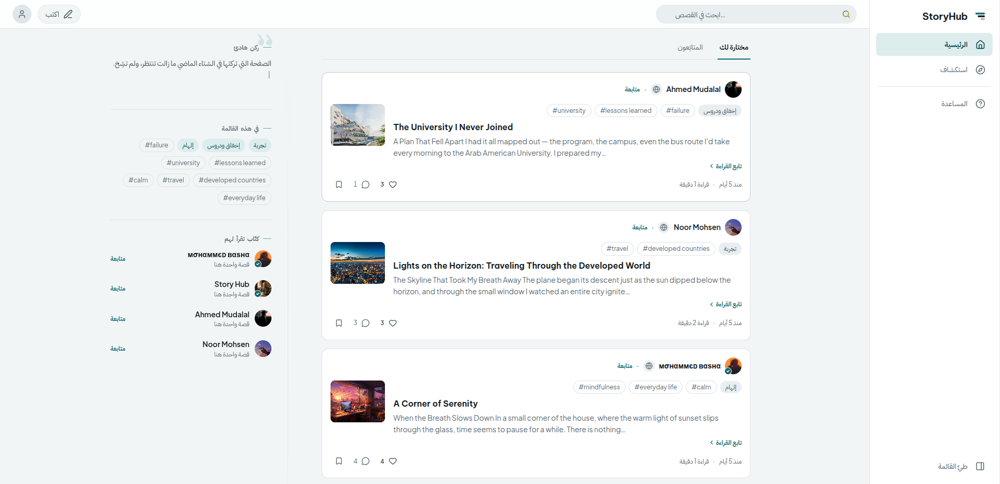 | 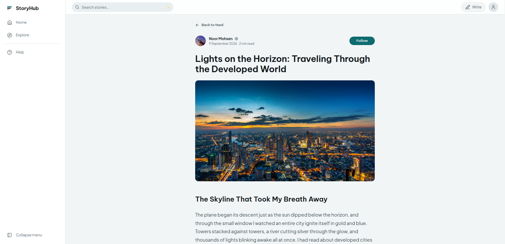 |

| Editor | Explore |
|---|---|
| 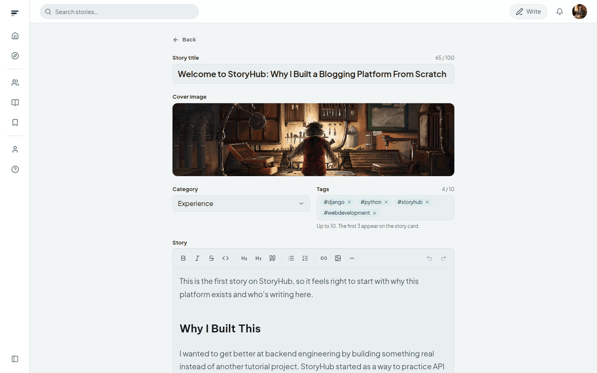 | 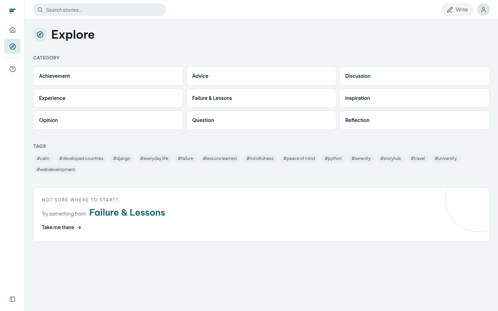 |

| Writer's page | Help centre |
|---|---|
| 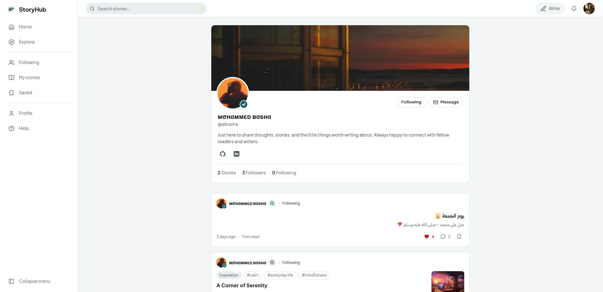 | 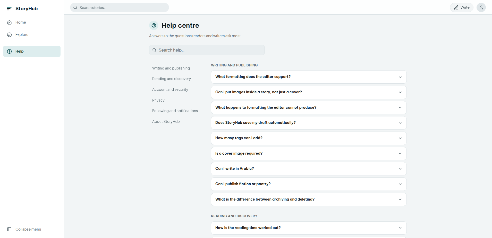 |

  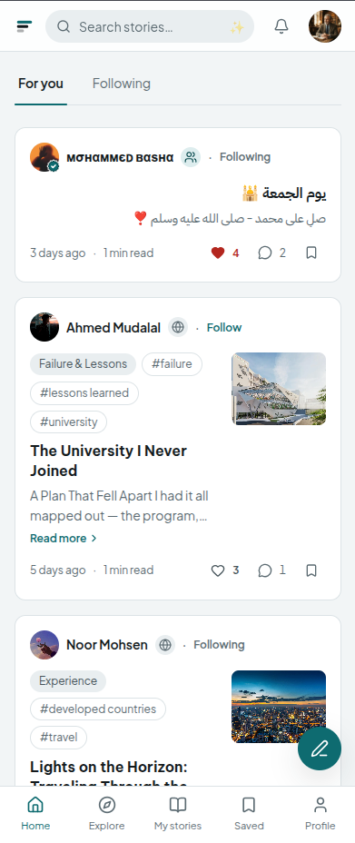
  &nbsp;&nbsp;&nbsp;
  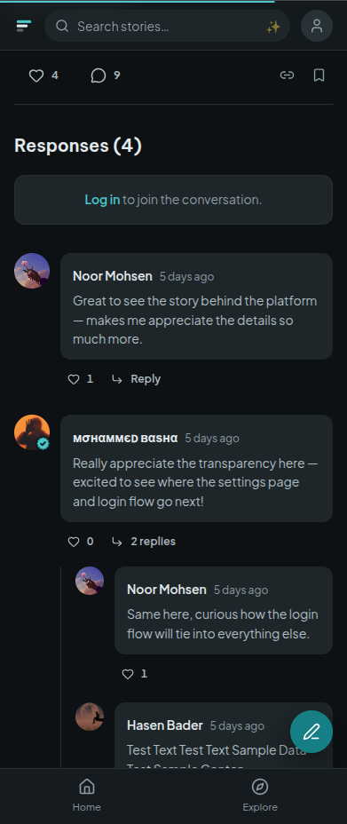

## Features

### Writing
- Draft → Published → Archived, plus permanent deletion, from a single **My stories** page
- A rich-text editor: bold, italic, strikethrough, inline code, two heading levels, quotes, bulleted and numbered lists, links, images and a divider — with undo/redo and the usual shortcuts
- Inline images upload the moment they are picked, so they appear in place while you write (JPG, PNG or WEBP, up to 10 MB each); an optional cover image with the same rules
- The editor follows the direction of what you type, so an Arabic story lays itself out right-to-left without a setting
- Drafts are kept in the browser as you type, and can be saved to the account
- A category (one of a small, owner-managed set) and up to ten free-form tags, shared across the site
- Who may read it: everyone, or followers only — chosen in the publish bar and changeable at any time
- A reading-time estimate that accounts for the script the story is written in and the images in it

### Reading and discovery
- A **For you** feed and a **Following** feed, filtered by category, tag or search, with infinite scroll
- Reading is open: stories, writers' pages, Explore and Help need no account — only writing and interacting do
- **Explore**: every category and tag, plus a spotlight suggesting one to try
- The **feed companion**: the categories, tags and writers most present in the stories on screen — a writer earns a place there once one of their stories has drawn three likes, or their identity is verified
- Story cards show "Read more" only when the card is actually holding text back

### Social
- Follow and unfollow writers; a paginated followers / following list on every page
- Like stories and comments; bookmark stories, with a saved-stories page
- Threaded comments — top-level comments and one level of replies, each paginated independently
- Notifications with an unread count, marked read as they are seen, and deep links to the story or comment concerned — including one when a writer you follow publishes
- Optimistic updates everywhere: the interface reacts at once and rolls back only if the request actually fails, and a story's state stays in sync across every list it appears in

### Accounts
- Email registration with mandatory activation (Djoser, emails sent through Celery)
- JWT sign-in with silent refresh and refresh-token blacklisting on sign-out
- **Google sign-in** — Google Identity Services on the client, ID-token verification on the server; a Google-only account gets a *set password* flow instead of *change password*
- Password reset, and an email-change flow that confirms at the **new** address before anything changes
- Profiles with avatar, cover, bio, location, birthday and links (website, GitHub, LinkedIn); a private view for the owner and a public view for everyone else
- A **verified identity** badge, granted by the site, shown wherever the writer's name is

### Interface
- English and Arabic, switchable from the account menu, with the whole layout mirroring
- Light and dark themes, following the system by default and remembered once chosen — applied before first paint, so there is no flash
- Responsive from phones (bottom navigation, a search overlay) to wide screens (a collapsible rail, the feed companion)
- Accessible primitives (Radix) for menus, dialogs, tooltips, tabs, selects and accordions, with direction-aware keyboard navigation
- A help centre searchable as you type

### Back end
- Story bodies are HTML, **sanitised once on write** with an allow-list (`nh3`); no read path has to remember to escape anything
- Request throttling: 120/min anonymous, 300/min signed in, and **10/min on the endpoints that trade a secret for a session**
- `django-silk` profiling in development only — guarded so it cannot run in production or under tests
- Missing database configuration fails at start-up with a message that says which variable, rather than at the first query
- Categories cached in Redis, invalidated on change; Arabic labels stored alongside the English key
- Slugs that survive Arabic titles (`allow_unicode`), with a uniqueness retry instead of a silent empty slug
- Orphaned media removed on change (`django-cleanup`)

## Tech stack

### Back end

| Technology | Version | Role |
|---|---|---|
| Python | 3.12 | |
| Django | 6.0 | Core framework |
| Django REST Framework | 3.17 | API layer |
| PostgreSQL | — | Database (`psycopg` 3) |
| Djoser + SimpleJWT | 2.3 / 5.5 | Registration, activation, password flows; JWT issue, refresh and blacklist |
| google-auth | 2.56 | Verifying Google ID tokens |
| Celery + Redis | 5.6 | Transactional email off the request path; Redis is broker and cache |
| django-redis | 7.0 | Cache backend |
| nh3 | 0.3 | HTML sanitising (Rust-backed `ammonia`) |
| django-filter | 26.1 | Category / tag filtering |
| django-cors-headers | 4.9 | The separate front-end origin |
| drf-spectacular | 0.30 | OpenAPI schema, Swagger UI and Redoc |
| django-cleanup | 9.0 | Orphaned media removal |
| django-silk | 5.5 | Profiling, development only |
| Pillow | 12.3 | Image validation and processing |

### Front end

| Technology | Version | Role |
|---|---|---|
| React | 19 | UI |
| TypeScript | strict | Types across the whole app |
| Vite | 8 | Dev server and build; every route is a separate chunk |
| React Router | 7 | Routing and route guards |
| TanStack Query | 5 | Server state, pagination, optimistic updates |
| Zustand | 5 | Client state: auth, theme, UI |
| Axios | 1 | HTTP with an interceptor-based token refresh |
| Tailwind CSS | v4 | Utilities over CSS-variable tokens (`@theme`) |
| Radix UI | — | Accordion, dialog, dropdown menu, select, tabs, tooltip, direction |
| Tiptap | 3 | The editor (ProseMirror) |
| i18next + react-i18next | 26 / 17 | Translation, plurals, language detection |
| lucide-react | — | Icons |
| date-fns | 4 | Locale-aware dates |
| sonner | 2 | Toasts |
| Plus Jakarta Sans · Be Vietnam Pro · IBM Plex Sans Arabic | — | Display, body and Arabic typefaces, self-hosted via Fontsource |

## Architecture and design decisions

**Two projects, one contract.** The API and the SPA live and deploy separately and speak only over REST. The OpenAPI schema (`backend/schema.yml`) is generated from the code, so the contract is a real document rather than an implicit one.

**Sanitise once, on write.** The editor sends HTML, and a request is just a POST — anyone can send `<script>` whatever the editor allows. Story bodies are cleaned against an allow-list before they are stored, so the database only ever holds markup that is safe to render, and no read path — the API, the admin, a future export — has to remember to escape anything.

**One cache patcher instead of per-page wiring.** Every list that shows a story has its own React Query cache entry, in its own shape. Rather than teaching each mutation the keys and shapes it must update, `lib/storyCache.ts` walks every cached entry, recognises a story by its slug wherever it is nested, and patches it in place. A new page that renders stories in a new shape is kept in sync for free.

**Tokens, not variants.** Every colour is a CSS custom property with a light and a dark value; Tailwind's `@theme` layer only points at them. Switching theme is one class on `<html>`, and no component carries `dark:` variants. Anything drawn on the site's deep "plane" (the landing page, the sign-in panel) uses a dedicated accent token that reads on that surface in both themes.

**Direction is data, not styling.** The document's `dir` follows the language; components use logical properties (`ms-`, `pe-`, `start-`); Radix gets a `DirectionProvider`; and user-supplied inline text — names, `@handles`, `#tags` — is wrapped in `<bdi>` so a line keeps the page's direction while the word keeps its own. `dir="auto"` is reserved for paragraphs and inputs.

**A key and a label per category.** The English name is the stable key stories carry and the editor matches on; the slug is what URLs carry and the API filters by; the label is whichever of `name` / `name_ar` fits the interface language. Renaming a label never breaks a link.

**The visitor page is honest about being a demonstration.** Its writer card, counts and pictures are fixed and shipped with the page; nothing on it depends on an account existing. The one live link — the credit in the footer — points at a real profile, whose handle is set in exactly one place (`lib/site.ts`).

**Pinned planes.** The landing page is a single dark plane with a sheet of sections sliding over it: the hero is `sticky top-0`, the closing is `sticky bottom-0`, and the five sections between them travel as one opaque sheet. Animations are gated on visibility (a background tab never starts them) and on `prefers-reduced-motion` (the finished sentence is rendered instead of typed).

**Polling, for now.** Notifications refresh every 15 seconds and on focus; the feed every 45 seconds. It needs no extra infrastructure and is enough at this scale. Django Channels is the natural next step and is on the roadmap.

## Roadmap

- **Media storage** — uploads currently live on local disk; production needs object storage
- **Image resizing on upload** — covers and avatars are stored at their original size
- **Full-text search** — search is `icontains` over the HTML body; a PostgreSQL search vector over the text would be both faster and cleaner
- **Prerendered landing page** for link previews on social platforms
- **Django Channels** — push notifications instead of polling
- **Popular tags by usage**, rather than alphabetically

## Source code

StoryHub is a live product, and its source is kept private. The repository behind it holds the Django REST API, the PostgreSQL schema, the sanitiser and security work, the React front end, and the server configuration it runs on — I am glad to walk through any of it. Write to **storyhub.app@gmail.com**.

## Acknowledgments

- **Back end** — designed and built independently, from data modelling to every endpoint; the v2 review and hardening was done with [Claude](https://claude.ai) (Anthropic).
- **Front end** — the v1 interface was designed with [Google Stitch](https://stitch.withgoogle.com/); v2's design system, landing page and rebuild were made with Claude.

## License

All rights reserved. This project is part of my personal portfolio and is for demonstration purposes only. Unauthorised copying, modification, or distribution is prohibited.
